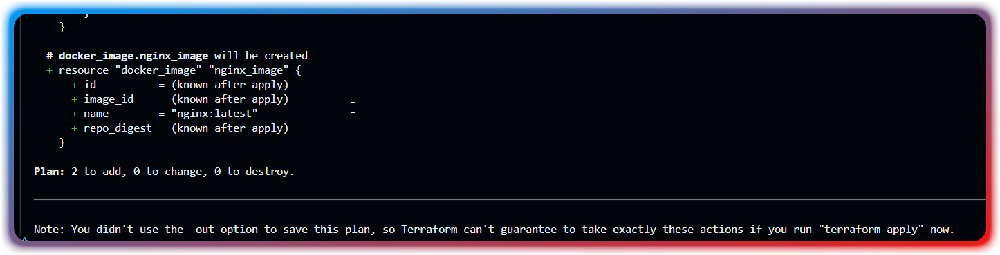

# Terraform Docker Projekt

## Beschreibung
Dieses Projekt demonstriert die Grundlagen von Infrastructure as Code (IaC) mit Terraform.
Es erstellt einen NGINX-Container mit Docker unter Verwendung von Terraform.

## Projektstruktur
```
terraform/
└── first-steps/
    ├── provider.tf  # Provider-Konfiguration
    └── main.tf      # Hauptkonfiguration
```

## Voraussetzungen
- Terraform (getestet mit Version 1.12.1)
- Docker Desktop für Windows

## Befehle
```bash
terraform init   # Initialisiert das Terraform-Projekt
terraform plan  # Zeigt geplante Änderungen
```

## Screenshots

### Terraform Init


### Terraform Plan




___

## Beantwortung der Reflexionsfragen
Was ist die Rolle des provider Blocks?
Der Provider Block konfiguriert den spezifischen Infrastructure Provider (hier Docker)
Er stellt die Verbindung zwischen Terraform und der Zielplattform her

Was ist die Rolle des resource Blocks?
Resource Blocks definieren die tatsächlichen Infrastrukturkomponenten
Sie repräsentieren verwaltbare Einheiten (hier: Docker Image und Container)

Implizite Abhängigkeit
Erstellt durch image = docker_image.nginx_image.name
Terraform versteht dadurch, dass der Container das Image benötigt
Wichtig für die korrekte Reihenfolge der Ressourcenerstellung

terraform init
Lädt Provider-Plugins herunter
Initialisiert das Backend
Erstellt lokale Terraform-Arbeitsverzeichnisse

terraform plan
Zeigt geplante Infrastrukturänderungen
Prüft aktuelle gegen gewünschte Konfiguration
Erstellt einen Ausführungsplan (+create, -destroy, ~modify)